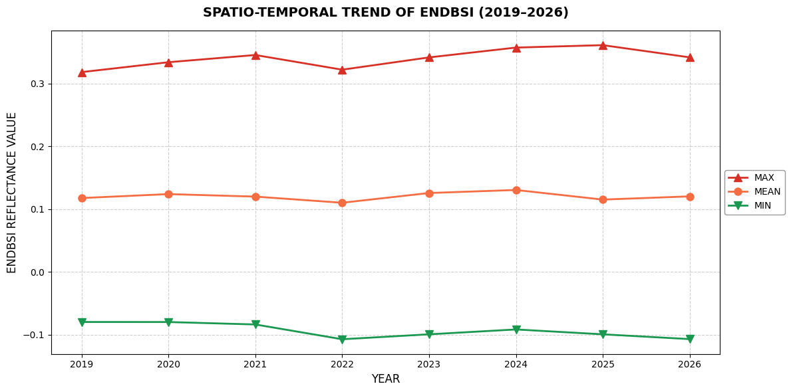

# Analisis Spasial-Temporal: Deteksi Perubahan Tanah Terbuka Wilayah Pulau Menggunakan ENDBSI dan Masking Air AWEI

**oleh : Defani Arman Alfitriansyah**

[](https://colab.research.google.com/drive/1DrIMu5FIGRAwKuoIzHWMqcXddOXVT9Wh?usp=sharing)

<div align="left">
  <a href="https://linkedin.com/in/defaniarmanalfitriansyah"></a>
  <a href="https://medium.com/@defaniarman"></a>
  <a href="https://tiktok.com/@defaniarman"></a>
  <a href="https://www.instagram.com/de.fanii"></a>
  <a href="https://www.kaggle.com/defani123"></a>
  <a href="https://rpubs.com/defanii"></a>
  <a href="https://www.behance.net/defaniarman"></a>
  <a href="mailto:defaniarman@gmail.com"></a>
  <a href="https://github.com/Defani"></a>
</div>

---

## Tujuan 

Analisis ini bertujuan untuk memantau dinamika perubahan luas dan tingkat keterbukaan lahan (tanah terbuka/bare soil) di suatu kawasan kepulauan selama periode 2019–2026.

### Tantangan Utama

- Pemisahan Daratan-Lautan: Memisahkan wilayah daratan dari lautan/badan air
- Eliminasi Bayangan Topografi: Menghilangkan gangguan bayangan pesisir
- Analisis Spasial-Temporal: Mengukur perubahan tanah terbuka dalam jangka waktu panjang

### Solusi yang Diimplementasikan

1. Masking Air AWEI(sh): Menggunakan indeks air untuk mengisolasi daratan
2. Indeks Tanah Terbuka ENDBSI: Menghitung indeks eksklusif pada wilayah daratan yang tervalidasi

---

## Metodologi dan Indeks Spektral

### A. Automated Water Extraction Index - shadow (AWEI_sh)

Indeks ini dirancang khusus untuk mengekstrak badan air secara otomatis sekaligus menghilangkan noise dari bayangan gelap.

**Referensi**: Feyisa et al., 2014

**Formula**:

AWEI_sh = Blue + 2.5 × Green - 1.5 × (NIR + SWIR_1) - 0.25 × SWIR_2

**Karakteristik**:
- Nilai positif = Air/Badan Air
- Nilai negatif atau nol = Daratan
- Sensitif terhadap bayangan dan refleksi cahaya

Dimana:
- B2 (Blue): Band 2 Sentinel-2 (490 nm)
- B3 (Green): Band 3 Sentinel-2 (560 nm)
- B8 (NIR): Band 8 Sentinel-2 (842 nm)
- B11 (SWIR_1): Band 11 Sentinel-2 (1610 nm)
- B12 (SWIR_2): Band 12 Sentinel-2 (2190 nm)

---

### B. Enhanced Normalized Difference Bare Soil Index (ENDBSI)

Indeks ini sangat sensitif untuk membedakan tanah terbuka murni dari tutupan lahan lain (seperti bangunan beton atau vegetasi kering).

**Referensi**: Chen et al., 2026

**Formula**:

ENDBSI = (3 × SWIR_1 + Red - Blue - Green - NIR - SWIR_2) / (3 × SWIR_1 + Red + Blue + Green + NIR + SWIR_2)

**Rentang Nilai**:
- -1 hingga +1: Nilai negatif = vegetasi, Positif = tanah terbuka
- Dioptimalkan untuk wilayah perkotaan dan daratan pulau

**Interpretasi**:
- Nilai negatif (-1 hingga 0): Vegetasi dan tubuh air
- Nilai positif (0 hingga +1): Tanah terbuka murni

---

## Logika Cloud Masking dan Thresholding

### Proses Pemisahan Air dan Daratan

Indeks AWEI_sh diformulasikan agar:
- Nilai pantulan air menjadi positif
- Nilai non-air menjadi negatif

**Logika Piksel Spasial (if-else)**:

Untuk setiap piksel (x,y):
- Jika AWEI_sh > 0 → Piksel diklasifikasikan sebagai Air (Masked/Dihapus)
- Jika AWEI_sh ≤ 0 → Piksel diklasifikasikan sebagai Daratan (Valid untuk ENDBSI)

### Algoritma Masking Lengkap

1. Hitung AWEI_sh untuk setiap piksel dari citra Sentinel-2 Surface Reflectance
2. Evaluasi kondisi threshold untuk setiap piksel:
   - Jika AWEI_sh > 0: Piksel diubah menjadi NoData (dihapus dari analisis)
   - Jika AWEI_sh ≤ 0: Piksel diproses oleh rumus ENDBSI
3. Update mask pada citra ENDBSI menggunakan daratan yang tervalidasi
4. Hitung statistik (Mean, Persentil ke-2 dan ke-98) hanya dari wilayah daratan

**Keuntungan Metode Ini**:
- Menghilangkan bias dari nilai pantulan air dalam perhitungan statistik
- Meningkatkan akurasi identifikasi tanah terbuka di wilayah pesisir
- Mengurangi pengaruh bayangan topografi dari tebing pantai

---

## Pustaka Python yang Digunakan

| Pustaka | Fungsi Utama | Referensi |
|---------|--------------|-----------|
| earthengine-api | API dasar Google Earth Engine untuk komputasi cloud spasial dan pengaksesan dataset | Google Earth Engine Documentation |
| geemap | Integrasi GEE dengan Python, pemrosesan koleksi citra, dan eksport peta interaktif | Wu, Q. (2020). JOSS, 5(51), 2305 |
| cartoee | Modul geemap untuk eksport peta statis berkualitas publikasi jurnal ilmiah | Markert, K. N. (2019). JOSS, 4(33), 1207 |
| cartopy | Proyeksi kartografi spasial dan sistem referensi koordinat (CRS) untuk presisi geografis | Met Office (2013) |
| matplotlib | Plotting grafik tren temporal 2D, tata letak kanvas, colorbar, dan elemen legenda | Hunter, J. D. (2007). CSE, 9(3), 90-95 |
| imageio | Pembacaan/penulisan gambar raster, dan pembuatan animasi GIF dari frame PNG tahunan | ImageIO Documentation |

---

## Alur Kerja Analisis

### Tahap 1: Instalasi dan Import Library

Langkah pertama adalah memasang seluruh pustaka pihak ketiga yang dibutuhkan untuk komputasi spasial, kemudian mengimpor modul-modul tersebut ke dalam memori lingkungan kerja.

```python
!pip install earthengine-api geemap cartopy matplotlib imageio

import ee
import geemap.cartoee as cartoee
import geemap.colormaps as cm
import matplotlib.pyplot as plt
import matplotlib as mpl
import matplotlib.patches as mpatches
from matplotlib.colors import LinearSegmentedColormap
import cartopy.crs as ccrs
import imageio.v2 as imageio_v2
from cartopy.mpl.gridliner import LONGITUDE_FORMATTER, LATITUDE_FORMATTER
from cartopy.mpl.geoaxes import GeoAxes
```

### Tahap 2: Autentikasi Google Earth Engine

Menghubungkan lingkungan kerja Python dengan peladen komputasi awan Google Earth Engine.

```python
ee.Authenticate()  # Verifikasi identitas dan dapatkan token akses
ee.Initialize(project='ee-defaniarman')  # Inisialisasi sesi GEE
```

### Tahap 3: Definisikan Area of Interest (AOI)

Menentukan batas geografis wilayah studi dalam format poligon koordinat.

```python
roi = ee.Geometry.Polygon([[
    [128.31268280537424, 0.7648247357638791],
    [128.3597180226594, 0.7648247357638791],
    [128.3597180226594, 0.811683855445309],
    [128.31268280537424, 0.811683855445309],
    [128.31268280537424, 0.7648247357638791]
]])
bounds = roi.bounds().getInfo()['coordinates'][0]
region_bbox = [bounds[0][0], bounds[0][1], bounds[2][0], bounds[2][1]]
```

### Tahap 4: Fungsi Penyesuaian Skala Reflektan

Mengkonversi nilai Digital Number (DN) mentah menjadi nilai reflektansi permukaan yang sebenarnya.

```python
def apply_scale(image):
    # Konversi DN ke Reflektansi dengan faktor skala 0.0001 (DN / 10000)
    return image.divide(10000).copyProperties(image, ['system:time_start'])
```

### Tahap 5: Fungsi Perhitungan Indeks Spektral

Menghitung indeks ENDBSI dan AWEI_sh dari band-band spektral Sentinel-2.

```python
def add_indices(image):
    b2 = image.select('B2')
    b3 = image.select('B3')
    b4 = image.select('B4')
    b8 = image.select('B8')
    b11 = image.select('B11')
    b12 = image.select('B12')
    
    # Hitung ENDBSI
    num = b11.multiply(3).add(b4).subtract(b2).subtract(b3).subtract(b8).subtract(b12)
    den = b11.multiply(3).add(b4).add(b2).add(b3).add(b8).add(b12)
    endbsi = num.divide(den).rename('ENDBSI')
    
    # Hitung AWEI_sh
    awei_sh = (b2.add(b3.multiply(2.5))
               .subtract(b8.add(b11).multiply(1.5))
               .subtract(b12.multiply(0.25))
               .rename('AWEI_sh'))
    
    return image.addBands(endbsi).addBands(awei_sh)
```

### Tahap 6: Konstruksi Komposit Citra Tahunan

Membangun komposit citra Sentinel-2 Surface Reflectance median tahunan untuk masing-masing tahun.

```python
def get_annual_composite(year):
    start = ee.Date.fromYMD(year, 1, 1)
    end = ee.Date.fromYMD(year, 12, 31)
    
    return (ee.ImageCollection('COPERNICUS/S2_SR_HARMONIZED')
            .filterBounds(roi)
            .filterDate(start, end)
            .filter(ee.Filter.lt('CLOUDY_PIXEL_PERCENTAGE', 20))
            .map(apply_scale)
            .map(add_indices)
            .median()
            .clip(roi)
            .set('year', year))

years = ee.List.sequence(2019, 2026)
col = ee.ImageCollection(years.map(get_annual_composite))
```

Langkah-langkah dalam fungsi:
1. Filter citra Sentinel-2 SR untuk tahun spesifik (1 Januari - 31 Desember)
2. Hanya ambil citra yang melingkupi AOI
3. Filter awan dengan persentase tutupan < 20%
4. Terapkan fungsi apply_scale untuk normalisasi nilai DN
5. Terapkan fungsi add_indices untuk perhitungan indeks
6. Hitung median dari seluruh citra yang tersisa untuk mengurangi noise
7. Potong (clip) citra komposit sesuai batas AOI

### Tahap 7: Rendering dan Visualisasi Spasial

Membuat rangkaian peta tahunan dengan masking air dan visualisasi ENDBSI dinamis.

Untuk setiap tahun dalam rentang 2019-2026:
1. Filter citra komposit berdasarkan tahun
2. Seleksi band ENDBSI dan AWEI_sh
3. Buat mask daratan (AWEI_sh ≤ 0) dan hapus piksel air (AWEI_sh > 0)
4. Hitung statistik persentil ke-2 dan ke-98 untuk rentang visualisasi dinamis
5. Setup plotting dengan matplotlib dan cartopy (proyeksi PlateCarree)
6. Tambahkan layer ENDBSI daratan dan layer air ke peta
7. Konfigurasi gridlines dan label lintang/bujur
8. Tambahkan judul, sumber data, dan label tahun
9. Render colorbar dengan skala nilai yang disesuaikan
10. Simpan setiap frame sebagai file PNG

### Tahap 8: Pembuatan Animasi GIF

Menggabungkan seluruh frame PNG tahunan menjadi satu file animasi GIF.

```python
import imageio.v2 as imageio_v2
import os

frames = ['frame_endbsi_2019.png', 'frame_endbsi_2020.png', ..., 'frame_endbsi_2026.png']
output_gif = 'ENDBSI_AWEI_Temporal_2019_2026.gif'

with imageio_v2.get_writer(output_gif, mode='I', duration=1.5, loop=0) as writer:
    for fname in frames:
        writer.append_data(imageio_v2.imread(fname))
```

Spesifikasi GIF:
- Durasi per frame: 1.5 detik
- Loop: Infinite (diputar berulang-ulang)
- Format: 150 DPI untuk kualitas tinggi

### Tahap 9: Analisis Tren Temporal

Membuat grafik line chart untuk menunjukkan tren perubahan ENDBSI dari 2019 hingga 2026.

```python
def get_endbsi_stats(img):
    endbsi = img.select('ENDBSI')
    awei_sh = img.select('AWEI_sh')
    
    land_mask = awei_sh.lte(0)
    endbsi_land = endbsi.updateMask(land_mask)
    
    reducers = ee.Reducer.mean().combine(
        reducer2=ee.Reducer.percentile([2, 98]),
        sharedInputs=True
    )
    
    stats = endbsi_land.reduceRegion(
        reducer=reducers,
        geometry=roi,
        scale=10,
        maxPixels=1e9
    )
    return img.set(stats)

stats_fc = col.map(get_endbsi_stats)
stats_data = stats_fc.getInfo()['features']

# Extract plot data
plot_years = [f['properties']['year'] for f in stats_data]
plot_mean = [f['properties'].get('ENDBSI_mean') for f in stats_data]
plot_min = [f['properties'].get('ENDBSI_p2') for f in stats_data]
plot_max = [f['properties'].get('ENDBSI_p98') for f in stats_data]

# Plot line chart
fig, ax = plt.subplots(figsize=(12, 6))
ax.plot(plot_years, plot_max, color='#d73027', marker='^', linewidth=2, label='MAX (P98)')
ax.plot(plot_years, plot_mean, color='#f46d43', marker='o', linewidth=2, label='MEAN')
ax.plot(plot_years, plot_min, color='#1a9850', marker='v', linewidth=2, label='MIN (P2)')
ax.set_title('SPATIO-TEMPORAL TREND OF ENDBSI (2019-2026)', fontsize=14, fontweight='bold')
ax.set_xlabel('YEAR', fontsize=12)
ax.set_ylabel('ENDBSI REFLECTANCE VALUE', fontsize=12)
ax.grid(True, linestyle='--', alpha=0.6)
ax.legend()
plt.tight_layout()
plt.savefig('Chart_Trend_ENDBSI.png', dpi=150, bbox_inches='tight')
```

---

## Output Hasil Analisis

### Animasi Spasial-Temporal ENDBSI dengan Masking Air AWEI

Animasi ini menampilkan perubahan indeks ENDBSI dari tahun 2019 hingga 2026 dengan air yang sudah dimasking (dihapus).

.gif)

**Deskripsi Visual**:
- Warna Hijau: Tanah terbuka dengan nilai ENDBSI rendah (belum terbuka sepenuhnya)
- Warna Kuning/Orange: Tanah terbuka sedang (intermediate bare soil)
- Warna Merah: Tanah terbuka tinggi (bare soil yang jelas dan murni)
- Warna Biru: Badan air (sudah dimasking oleh AWEI_sh > 0)
- Colorbar: Menunjukkan rentang nilai ENDBSI yang dinamis per tahun sesuai statistik lokal

**Kegunaan**:
- Monitoring perubahan luas tanah terbuka sepanjang periode
- Deteksi dini revegetasi atau degradasi lahan
- Identifikasi area dengan risiko erosi tinggi

---

### Animasi True Color Composite (Warna Asli)

Menampilkan citra satelit mendekati apa yang dilihat mata manusia dengan pemetaan langsung band spektral ke saluran RGB.

.gif)

**Spesifikasi Teknis**:
- Band B4 (Red): Saluran Merah (650 nm)
- Band B3 (Green): Saluran Hijau (560 nm)
- Band B2 (Blue): Saluran Biru (490 nm)
- Gamma correction: 1.3 untuk optimal contrast
- Min/Max stretch: 0.0 - 0.3 reflectance

**Interpretasi Warna**:
- Hijau gelap: Vegetasi rapat
- Coklat/Kuning: Tanah dan area terbuka
- Biru: Badan air
- Abu-abu/Putih: Area terbangun atau awan

**Kegunaan**:
- Verifikasi visual perubahan tutupan lahan
- Deteksi perubahan penggunaan lahan
- Validasi ground-truth untuk akurasi analisis

---

### Animasi False Color Composite (Warna Palsu)

Menampilkan kombinasi spektral untuk menonjolkan fitur yang tidak terlihat dalam True Color, terutama vegetasi dan batas water-land.


**Spesifikasi Teknis**:
- Band B8 (NIR, 842 nm): Saluran Merah
- Band B4 (Red, 650 nm): Saluran Hijau
- Band B3 (Green, 560 nm): Saluran Biru
- Gamma correction: 1.3
- Min/Max stretch: 0.0 - 0.5 reflectance

**Interpretasi Warna**:
- Merah terang: Vegetasi rapat (NIR reflectance tinggi)
- Orange/Kuning: Vegetasi sedang dan area bermixed
- Coklat/Abu: Tanah, bangunan, dan area terbuka
- Biru gelap: Badan air (NIR absorption tinggi)

**Kegunaan**:
- Deteksi vegetasi lebih akurat daripada True Color
- Perbedaan tipologi lahan berdasarkan respons spektral NIR
- Monitoring perubahan dinamis vegetasi sepanjang tahun
- Identifikasi stress vegetasi

---

### Output Statistik Nilai Indeks NDBSI


---
## Petunjuk Penggunaan

### Persyaratan Awal

1. Akun Google (untuk akses Google Colab)
2. Akun Google Earth Engine (daftar di https://earthengine.google.com/signup/)
3. Google Cloud Project dengan quota unlimited (rekomendasi)

### Langkah-Langkah Eksekusi

1. Klik tombol "Open In Colab" di bagian atas repository untuk membuka notebook
2. Login dengan akun Google yang sudah terdaftar di Earth Engine
3. Edit cell authentication dan ubah project ID:
   ```python
   ee.Initialize(project='YOUR_GEE_PROJECT_ID')
   ```
4. Update koordinat area of interest (AOI):
   ```python
   roi = ee.Geometry.Polygon([[
       [lon_min, lat_min],
       [lon_max, lat_min],
       [lon_max, lat_max],
       [lon_min, lat_max],
       [lon_min, lat_min]
   ]])
   ```
5. Jalankan cell satu per satu dari atas ke bawah secara berurutan
6. Tunggu setiap cell selesai eksekusi sebelum melanjutkan
7. Output berupa file GIF dan PNG akan otomatis diunduh

### Tips Penggunaan

- Untuk AOI besar, tingkatkan durasi timeout di menu Runtime > Change runtime type
- Jika memory error, kurangi resolusi scale parameter atau tahun analisis
- Untuk publikasi, export hasil dengan resolusi 300 dpi di menu export

---

## Daftar Pustaka

### Indeks dan Metodologi

Chen, J., Zhong, Y., Tang, B.-H., Huang, L., Fu, Z., Fan, D., Zhao, T., & Yang, C. (2026). ENDBSI: an Enhanced Normalized Difference Bare Soil Index for identifying the bare soil of urban and rural areas. Remote Sensing of Environment, Forthcoming.

Feyisa, G. L., Meilby, H., Fensholt, R., & Proud, S. R. (2014). Automated Water Extraction Index: A new technique for surface water mapping using Landsat imagery. Remote Sensing of Environment, 140, 23-35. https://doi.org/10.1016/j.rse.2013.08.029

### Software dan Libraries

Hunter, J. D. (2007). Matplotlib: A 2D graphics environment. Computing in Science & Engineering, 9(3), 90-95. https://doi.org/10.1109/MCSE.2007.55

Markert, K. N. (2019). cartoee: Publication quality maps using Earth Engine. Journal of Open Source Software, 4(33), 1207. https://doi.org/10.21105/joss.01207

Met Office. (2013). Cartopy: A cartographic Python library with matplotlib support. Exeter, Devon. http://scitools.org.uk/cartopy

Wu, Q. (2020). geemap: A Python package for interactive mapping with Google Earth Engine. Journal of Open Source Software, 5(51), 2305. https://doi.org/10.21105/joss.02305

### Data Source

European Space Agency (ESA). Sentinel-2 Level-2A (L2A) Surface Reflectance. Copernicus Programme. https://developers.google.com/earth-engine/datasets/catalog/COPERNICUS_S2_SR_HARMONIZED

---

## Dokumentasi Package Resmi

| Package | URL Dokumentasi |
|---------|-----------------|
| Google Earth Engine API | https://developers.google.com/earth-engine |
| geemap | https://geemap.org/ |
| cartoee | https://cartoee.readthedocs.io/en/latest/ |
| cartopy | https://cartopy.readthedocs.io/stable/ |
| matplotlib | https://matplotlib.org/ |
| imageio | https://imageio.readthedocs.io/ |
| Sentinel-2 SR in GEE | https://developers.google.com/earth-engine/datasets/catalog/COPERNICUS_S2_SR_HARMONIZED |

---

## Fitur Utama

- Cloud-based Processing: Analisis seluruh data menggunakan Google Earth Engine dengan akses unlimited
- Multi-temporal Analysis: Data 8 tahun (2019-2026) dengan resolusi spasial 10 meter
- Advanced Masking: Eliminasi air dan bayangan menggunakan indeks AWEI dengan thresholding adaptif
- Publication-Quality Maps: Peta dengan standar publikasi ilmiah dan customizable colormaps
- Animated Visualization: GIF temporal untuk komunikasi hasil yang lebih efektif dan intuitif
- Reproducible Workflow: Kode terdokumentasi lengkap untuk penelitian dan publikasi lanjutan
- Statistical Analysis: Perhitungan statistik spasial-temporal dengan persentil dinamis per tahun

---

## Kontak dan Informasi

**Defani Arman Alfitriansyah**

Email: defaniarman@gmail.com
LinkedIn: https://linkedin.com/in/defaniarmanalfitriansyah
Medium: https://medium.com/@defaniarman
GitHub: https://github.com/Defani

---

Last Updated: June 1, 2026
Repository: https://github.com/Defani/EDBSI-SPATIO-TEMPORAL
