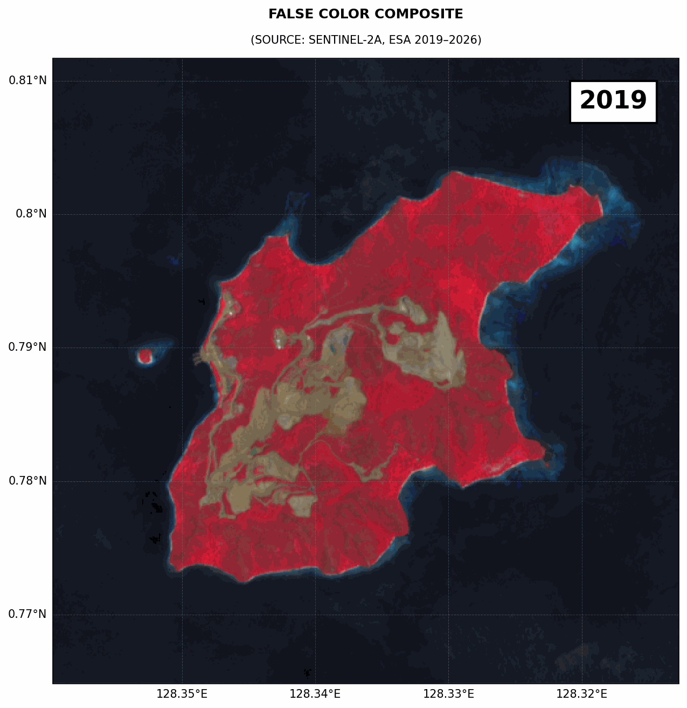

# 🛰️ Analisis Spasial-Temporal: Deteksi Perubahan Tanah Terbuka Wilayah Pulau Menggunakan ENDBSI dan Masking Air AWEI

**oleh : Defani Arman Alfitriansyah**

<div align="left">
  <a href="https://linkedin.com/in/defaniarmanalfitriansyah"></a>
  <a href="https://medium.com/@defaniarman"></a>
  <a href="https://tiktok.com/@defaniarman"></a>
  <a href="https://www.instagram.com/de.fanii"></a>
  <a href="https://www.kaggle.com/defani123"></a>
  <a href="https://rpubs.com/defanii"></a>
  <a href="https://www.behance.net/defaniarman"></a>
  <a href="mailto:defaniarman@gmail.com"></a>
  <a href="https://github.com/Defani"></a>
</div>

---

## 📌 **Tujuan Penelitian**

Analisis ini bertujuan untuk **memantau dinamika perubahan luas dan tingkat keterbukaan lahan (tanah terbuka/ *bare soil*)** di suatu kawasan kepulauan selama periode **2019–2026**.

### Tantangan Utama:
- **Pemisahan Daratan-Lautan**: Memisahkan wilayah daratan dari lautan/badan air
- **Eliminasi Bayangan Topografi**: Menghilangkan gangguan bayangan pesisir
- **Analisis Spasial-Temporal**: Mengukur perubahan tanah terbuka dalam jangka waktu panjang

### Solusi yang Diimplementasikan:
1. **Masking Air AWEI$_{sh}$**: Menggunakan indeks air untuk mengisolasi daratan
2. **Indeks Tanah Terbuka ENDBSI**: Menghitung indeks eksklusif pada wilayah daratan yang tervalidasi

---

## 🔬 **Metodologi & Indeks Spektral**

### **A. Automated Water Extraction Index - shadow (AWEI$_{sh}$)**

Indeks ini dirancang khusus untuk **mengekstrak badan air secara otomatis** sekaligus menghilangkan *noise* dari bayangan gelap.

**Referensi**: Feyisa et al., 2014

**Formula:**
$$AWEI_{sh} = Blue + 2.5 \times Green - 1.5 \times (NIR + SWIR_1) - 0.25 \times SWIR_2$$

**Karakteristik:**
- Nilai positif → **Air/Badan Air**
- Nilai negatif atau nol → **Daratan**
- Sensitif terhadap bayangan dan refleksi cahaya

---

### **B. Enhanced Normalized Difference Bare Soil Index (ENDBSI)**

Indeks ini sangat **sensitif untuk membedakan tanah terbuka murni** dari tutupan lahan lain (seperti bangunan beton atau vegetasi kering).

**Referensi**: Chen et al., 2026

**Formula:**
$$ENDBSI = \frac{3 \times SWIR_1 + Red - Blue - Green - NIR - SWIR_2}{3 \times SWIR_1 + Red + Blue + Green + NIR + SWIR_2}$$

**Rentang Nilai:**
- **-1 hingga +1**: Nilai negatif = vegetasi, Positif = tanah terbuka
- Dioptimalkan untuk wilayah perkotaan dan daratan pulau

---

## ⚙️ **Logika Cloud Masking & Thresholding**

### **Proses Pemisahan Air dan Daratan**

Indeks AWEI$_{sh}$ diformulasikan agar:
- **Nilai pantulan air** → Positif
- **Nilai non-air** → Negatif

**Logika Piksel Spasial** (if-else):

$$
\text{Status Piksel}_{(x,y)} =
\begin{cases}
\text{Air (Masked / Dihapus)}, & \text{jika } AWEI_{sh} > 0 \\
\text{Daratan (Valid untuk ENDBSI)}, & \text{jika } AWEI_{sh} \le 0
\end{cases}
$$

### **Algoritma Masking:**

1. **Hitung AWEI$_{sh}$** untuk setiap piksel dari citra Sentinel-2 SR
2. **Evaluasi kondisi threshold**:
   - Jika AWEI$_{sh}$ > 0 → Piksel diubah menjadi *NoData* (dihapus dari analisis)
   - Jika AWEI$_{sh}$ ≤ 0 → Piksel diproses oleh rumus ENDBSI
3. **Update Mask** pada citra ENDBSI menggunakan daratan yang tervalidasi
4. **Hitung Statistik**: Mean, Persentil ke-2 dan ke-98 hanya dari wilayah daratan

---

## 📦 **Pustaka Python yang Digunakan**

| Pustaka | Versi | Fungsi Utama | Referensi |
|---------|-------|--------------|-----------|
| **`earthengine-api`** | Latest | API dasar Google Earth Engine untuk komputasi cloud spasial | [Google Earth Engine](https://earthengine.google.com) |
| **`geemap`** | Latest | Integrasi GEE dengan Python, pemrosesan koleksi citra, eksport interaktif | Wu, Q. (2020). JOSS, 5(51), 2305 |
| **`cartoee`** | Latest | Modul `geemap` untuk ekspor peta statis berkualitas publikasi | Markert, K. N. (2019). JOSS, 4(33), 1207 |
| **`cartopy`** | Latest | Proyeksi kartografi spasial dan sistem referensi koordinat (CRS) | Met Office (2013) |
| **`matplotlib`** | Latest | Plotting grafik tren temporal 2D, tata letak kanvas, colorbar | Hunter, J. D. (2007). CSE, 9(3), 90–95 |
| **`imageio`** | v2 | Pembacaan/penulisan gambar, pembuatan animasi GIF dari frame PNG | [ImageIO Docs](https://imageio.readthedocs.io) |

---

## 🚀 **Alur Kerja Analisis**

### **Tahap 1: Instalasi & Import Library**
```python
!pip install earthengine-api geemap cartopy matplotlib imageio

import ee
import geemap.cartoee as cartoee
import geemap.colormaps as cm
import matplotlib.pyplot as plt
import cartopy.crs as ccrs
import imageio.v2 as imageio_v2
```

### **Tahap 2: Autentikasi Google Earth Engine**
```python
ee.Authenticate()  # Verifikasi identitas & dapatkan token akses
ee.Initialize(project='ee-defaniarman')  # Inisialisasi sesi GEE
```

### **Tahap 3: Definisikan Area of Interest (AOI)**
- Input: Koordinat poligon wilayah studi
- Output: Bounding box dan geometry untuk filtering citra

### **Tahap 4: Fungsi Penyesuaian Skala**
```python
def apply_scale(image):
    # Konversi Digital Number (DN) ke Reflektansi Permukaan
    # Faktor skala: 0.0001 (DN / 10000)
    return image.divide(10000).copyProperties(image, ['system:time_start'])
```

### **Tahap 5: Fungsi Perhitungan Indeks**
```python
def add_indices(image):
    # Ekstraksi band: B2(Blue), B3(Green), B4(Red), B8(NIR), B11(SWIR1), B12(SWIR2)
    # Hitung ENDBSI
    # Hitung AWEI_sh
    # Tambahkan sebagai band baru
    return image.addBands(endbsi).addBands(awei_sh)
```

### **Tahap 6: Konstruksi Komposit Tahunan**
```python
def get_annual_composite(year):
    # Filter citra Sentinel-2 SR untuk tahun spesifik
    # Filter awan < 20%
    # Terapkan apply_scale & add_indices
    # Hitung median tahunan
    # Clip ke AOI
    return median_composite
```

### **Tahap 7: Rendering & Visualisasi Spasial**
- Loop setiap tahun (2019–2026)
- Lakukan masking air (AWEI$_{sh}$ > 0)
- Hitung statistik dinamis (min, max, mean)
- Render peta dengan `cartoee.add_layer()`
- Simpan frame PNG untuk setiap tahun

### **Tahap 8: Pembuatan Animasi GIF**
```python
# Gabungkan seluruh frame PNG menjadi 1 file GIF
# Durasi per frame: 1.5 detik
# Loop: Infinite
```

### **Tahap 9: Analisis Tren Temporal**
- Plot grafik line chart: MAX, MEAN, MIN ENDBSI
- Identifikasi tren perubahan tanah terbuka 2019–2026

---

## 📊 **Output Hasil Analisis**

### **Animasi Spasial-Temporal ENDBSI dengan Masking Air AWEI**

Animasi ini menampilkan perubahan indeks ENDBSI dari tahun 2019 hingga 2026 dengan air yang sudah dimasking (dihapus).

.gif)

**Deskripsi:**
- **Warna Hijau**: Tanah terbuka dengan nilai ENDBSI rendah (belum terbuka)
- **Warna Kuning/Orange**: Tanah terbuka sedang
- **Warna Merah**: Tanah terbuka tinggi (bare soil yang jelas)
- **Biru**: Badan air (sudah dimasking oleh AWEI$_{sh}$)
- **Colorbar**: Menunjukkan rentang nilai ENDBSI yang dinamis per tahun

---

### **Animasi True Color Composite (Warna Asli)**

Menampilkan citra satelit mendekati apa yang dilihat mata manusia (RGB: B4, B3, B2).

.gif)

**Karakteristik:**
- Band B4 (Merah) → Saluran Merah
- Band B3 (Hijau) → Saluran Hijau
- Band B2 (Biru) → Saluran Biru
- Gamma correction: 1.3 untuk kontras optimal
- **Kegunaan**: Verifikasi visual perubahan tutupan lahan

---

### **Animasi False Color Composite (Warna Palsu)**

Menampilkan kombinasi spektral untuk menonjolkan vegetasi dan batas water/land (NIR, Red, Green: B8, B4, B3).



**Karakteristik:**
- Band B8 (NIR) → Saluran Merah (vegetasi terlihat terang/merah)
- Band B4 (Merah) → Saluran Hijau
- Band B3 (Hijau) → Saluran Biru
- **Kegunaan**: Deteksi vegetasi, perbedaan tipologi lahan, perubahan dinamis

---

### **Chart Trend Analisis ENDBSI (2019–2026)**

Grafik garis menampilkan tren spasial-temporal nilai ENDBSI:
- **Garis Merah (MAX)**: Persentil ke-98 ENDBSI (tanah terbuka tertinggi)
- **Garis Orange (MEAN)**: Rata-rata ENDBSI di daratan
- **Garis Hijau (MIN)**: Persentil ke-2 ENDBSI (nilai minimal)

**Interpretasi:**
- Jika trend MAX meningkat → Peningkatan luas tanah terbuka
- Jika trend MAX menurun → Revegetasi atau perkembangan infrastruktur

---

## 🔗 **Akses & Reproducibility**

### **Buka di Google Colab**

[](https://colab.research.google.com/drive/1DrIMu5FIGRAwKuoIzHWMqcXddOXVT9Wh?usp=sharing)

**Petunjuk Penggunaan:**
1. Klik badge "Open In Colab" di atas
2. Login dengan akun Google yang sudah terdaftar di [Google Earth Engine](https://earthengine.google.com/signup/)
3. Update variabel `project='ee-defaniarman'` dengan project ID Anda
4. Ubah koordinat `roi` dengan wilayah studi Anda
5. Jalankan cell satu per satu dari atas ke bawah
6. Download hasil output (GIF dan Chart) secara otomatis

---

## 📚 **Daftar Pustaka (References)**

### **Indeks & Metodologi:**

1. **Chen, J., Zhong, Y., Tang, B.-H., Huang, L., Fu, Z., Fan, D., Zhao, T., & Yang, C.** (2026). ENDBSI: an Enhanced Normalized Difference Bare Soil Index for identifying the bare soil of urban and rural areas. *Remote Sensing of Environment*, Forthcoming.

2. **Feyisa, G. L., Meilby, H., Fensholt, R., & Proud, S. R.** (2014). Automated Water Extraction Index: A new technique for surface water mapping using Landsat imagery. *Remote Sensing of Environment*, 140, 23–35. https://doi.org/10.1016/j.rse.2013.08.029

### **Software & Libraries:**

3. **Hunter, J. D.** (2007). Matplotlib: A 2D graphics environment. *Computing in Science & Engineering*, 9(3), 90–95. https://doi.org/10.1109/MCSE.2007.55

4. **Markert, K. N.** (2019). cartoee: Publication quality maps using Earth Engine. *Journal of Open Source Software*, 4(33), 1207. https://doi.org/10.21105/joss.01207

5. **Met Office.** (2013). Cartopy: A cartographic Python library with matplotlib support. Exeter, Devon. http://scitools.org.uk/cartopy

6. **Wu, Q.** (2020). geemap: A Python package for interactive mapping with Google Earth Engine. *Journal of Open Source Software*, 5(51), 2305. https://doi.org/10.21105/joss.02305

### **Data Source:**

7. **European Space Agency (ESA).** Sentinel-2 Level-2A (L2A) Surface Reflectance. Copernicus Programme. https://developers.google.com/earth-engine/datasets/catalog/COPERNICUS_S2_SR_HARMONIZED

---

## 📖 **Dokumentasi Package**

Berikut adalah link dokumentasi resmi dari setiap pustaka yang digunakan:

| Package | URL Dokumentasi |
|---------|-----------------|
| **Google Earth Engine API** | https://developers.google.com/earth-engine |
| **geemap** | https://geemap.org/ |
| **cartoee** | https://cartoee.readthedocs.io/en/latest/ |
| **cartopy** | https://cartopy.readthedocs.io/stable/ |
| **matplotlib** | https://matplotlib.org/ |
| **imageio** | https://imageio.readthedocs.io/ |
| **Sentinel-2 SR in GEE** | https://developers.google.com/earth-engine/datasets/catalog/COPERNICUS_S2_SR_HARMONIZED |

---

## 🎯 **Key Features**

✅ **Cloud-based Processing**: Analisis seluruh data menggunakan Google Earth Engine (akses unlimited)  
✅ **Multi-temporal Analysis**: Data 8 tahun (2019–2026) dengan resolusi 10 meter  
✅ **Advanced Masking**: Eliminasi air & bayangan menggunakan AWEI index  
✅ **Publication-Quality Maps**: Peta dengan standar publikasi ilmiah  
✅ **Animated Visualization**: GIF temporal untuk komunikasi hasil yang lebih efektif  
✅ **Reproducible Workflow**: Kode terdokumentasi untuk penelitian lanjutan  

---

## 📝 **Lisensi & Kontribusi**

Repository ini terbuka untuk penggunaan akademis dan penelitian. Silakan:
- Fork repository untuk keperluan studi pribadi
- Buat Pull Request untuk peningkatan kode
- Citasi paper ini jika menggunakan metodologi dalam publikasi Anda

---

## 📧 **Kontak & Dukungan**

**Defani Arman Alfitriansyah**  
- Email: defaniarman@gmail.com
- LinkedIn: https://linkedin.com/in/defaniarmanalfitriansyah
- Medium: https://medium.com/@defaniarman
- GitHub: https://github.com/Defani

---

**Last Updated**: June 1, 2026  
**Repository**: [EDBSI-SPATIO-TEMPORAL](https://github.com/Defani/EDBSI-SPATIO-TEMPORAL)

